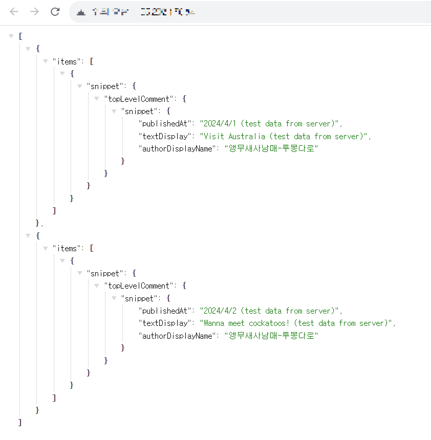

# Video Info Collector Backend
[Video Info Collector](https://github.com/sarifor/video-info-collector)에서 사용하는 데이터를 취득하는 백엔드 처리 모음입니다.

## Features
- 유튜브 채널 '앵무새사남매-루몽다로'의 최신 5개 영상의 공지 댓글 데이터 취득

## Component Diagram
[다이어그램 보러 가기](https://github.com/sarifor/video-info-collector#component-diagram)

## DB ERD
없음.

## Getting Started
프로젝트를 실행하는 방법에 대해 설명하겠습니다.
후술하겠지만 Google Cloud Platform의 VM 인스턴스 안에 다운받아 실행할 필요가 있습니다.
로컬에서 실행하고 싶은 경우엔 코드를 적절히 편집하여 사용해 주세요. 로컬 실행의 경우 별도 설명은 없습니다.

### Prerequisites
먼저 프로젝트를 실행하기 위한 환경을 마련합니다.

> 1. Google Cloud Platform(이하 GCP)의 VM 인스턴스에 접속합니다. (Ubuntu 권장)
> 2. Git과 Node.js 최신 버전을 설치합니다. 
> 3. Youtube API Key를 취득합니다.
>    - 3.1 https://console.developers.google.com/apis 접속
>    - 3.2 'YouTube Data API v3'를 선택하고 '사용' 버튼 클릭
>    - 3.3 액세스할 데이터로 '공개 데이터'를 선택하고 '다음' 버튼 클릭
>    - 3.4 API Key 발급이 완료됨.
> 4. Youtube API Key를 GCP의 Secret Manager에 저장합니다.
> 5. VM 인스턴스에서 Secret Manager에 저장된 Youtube API Key를 사용할 수 있도록 설정합니다.
>    - 5.1 VM 인스턴스의 '액세스 범위'를 '모든 Cloud API에 대한 전체 액세스 허용'으로 변경
>    - 5.2 VM 인스턴스의 '서비스 계정' 값을, Secret Manager의 secret manager의 '보안비밀 관리자 보안비밀 접근자'로 설정
> 6. 김로미의 얼굴을 떠올리고 살짝 미소가 지어졌다면, 환경 준비 성공입니다.

### Installing
환경이 마련되면, 깃허브에서 프로젝트를 다운로드하여, 프로젝트에 쓰이는 패키지를 설치하고 실행합니다.
이하 모두 GCP VM 인스턴스 안에서의 작업입니다.

> 5. git clone https://github.com/sarifor/video-info-collector-backend.git
> 6. cd 커맨드로 저장소 폴더 안에 들어가서 npm install 실행하여, package.json에 기술되어 있는 패키지 설치
> 7. npm run start로 프로젝트 실행
>    - pm2로 상시 실행. 일회성으로 실행하고 싶은 경우 node app.js 사용
> 8. VM 인스턴스의 IP에 접속했을 때, 아래와 같은 화면이 뜨면 성공! (사진에선 test data이나, Youtube API data일 때도 같은 모습입니다)
> 

## Built With
[사용 기술/플랫폼 보러 가기](https://github.com/sarifor/video-info-collector#built-with)

## Versioning
버전 관리법으로 [SemVer](http://semver.org/)을 사용하고 있습니다.

## Author
**Sarifor** - 프로젝트 구성, 구현, 트러블슈팅, 배포

## License
이 프로젝트는 MIT 라이센스를 준수합니다.